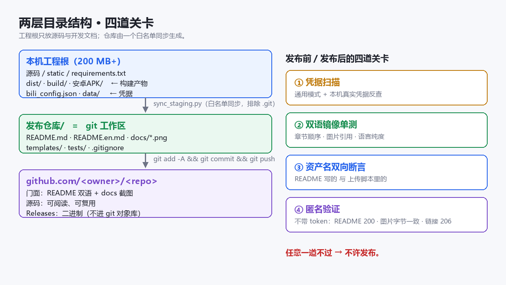
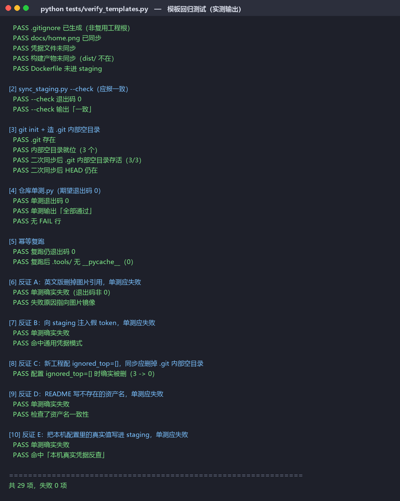

<div align="center">
<h1>GitHub Repo Publish Standard</h1>
<b>Turn a local project into a public repo that strangers can understand, download, and use</b><br>
Bilingual facade · whitelist sync · binaries via Releases · pre-publish scanning · post-publish anonymous verification

[简体中文](./README.md) | **English**

<a href="../../stargazers"></a>
<a href="../../forks"></a>
<a href="../../issues"></a>

<br>


</div>

---

A set of **format rules written for AI agents, plus tools you can copy straight into a project**. It solves one concrete problem: your project works locally, yet once it lands on GitHub nobody can understand it, download it, or trust it.

It reduces "uploading" to a fixed pipeline — whitelist sync (credentials and build artifacts never make it in), a bilingual README facade, real screenshots, binaries distributed through Releases, a credential scan before going public, and anonymous verification afterwards.

> ⚠️ **Three prerequisites — read these first:**
> **① "Bilingual" means the project page documents** (`README.md` / `README.en.md`), not your application UI;
> **② once a repo is public, the source is public too** — the credential scan is a last gate, not a safety net, so never rely on it as one;
> **③ Release assets of a private repo are unreachable for others**, so if downloads are the goal, the repo must be public.

## 🎬 What it looks like

This is not a GUI tool. What it produces is a **directory layout** and **a repo that passes its own checks**:

<div align="center">

<br>
<sub>Left: the two-layer structure — the project root holds sources and developer notes, while the repo is generated from a whitelist. Right: the four gates every publish must pass</sub>
</div>

<br>

The standard has to survive its own scrutiny. The image below is a capture of an **actual run** of `tests/verify_templates.py` — not a mockup, but real output rendered in a terminal style:

<div align="center">

<br>
<sub>29 checks plus 5 counter-proofs, all passing. The point of a counter-proof: disable the protection and the test really does fail — only then is the protection proven to work</sub>
</div>

## 📥 Get it

There are no releases (this is a plain-text skill with no binaries). Clone and use:

```bash
git clone https://github.com/gdSHAY/github-repo-publish-standard.git
```

Drop it into your agent's skill directory to have it loaded, or copy `templates/` alone if that is all you need.

## ✨ What it solves

| Common problem | What this standard does | Artifact |
| --- | --- | --- |
| The README is a pile of dev notes; outsiders bounce | Keep the **facade and the developer notes separate**; only the clean facade ships | `项目主页.md` → `README.md` |
| You updated Chinese and forgot English | The two versions are **enforced mirrors**: section order, image references, language purity | `templates/check_repo.py` |
| Screenshots went stale months ago | Assets are **regenerated by one command**, not captured once by hand | `templates/make_readme_assets.py` |
| Installers are committed into git; the repo bloats | Binaries go to Releases and **never enter the git object store** | `templates/publish_release.py` |
| Credentials got published along with the code | Whitelist sync plus a **dual scan**: generic patterns and your real local values | `templates/sync_staging.py` |
| It uploaded — but can anyone actually download it? | **Anonymous (no token)** verification down to the byte | `templates/verify_public.py` |
| Every repo ends up structured differently | One `repo_config.json` **drives every script** | `templates/repo_config.json` |

## ⚙️ Three steps to start

**Step one**: copy the config into your project's `.tools/` and edit four fields (`owner` / `repo` / `staging_dir` / `include`).

**Step two**: copy the scripts you need out of `templates/`:

```bash
mkdir -p .tools
cp templates/_repo_config.py templates/sync_staging.py templates/check_repo.py .tools/
cp templates/repo_config.json .tools/
```

**Step three**: sync, push, verify.

```bash
python .tools/sync_staging.py            # project root -> staging/ (--check compares only)
cd staging && git add -A && git commit -m "init" && git push
cd .. && python .tools/verify_public.py  # anonymous verification; all green means done
```

`--check` and dry-run are **the default**; every write requires an explicit switch (`--push`).

> **⚠️ One platform fact**: GitHub **does not support non-ASCII repository names**. A name it cannot normalize becomes `-`, leaving you with `owner/-`. Use an ASCII repo name and put the native-language name in the repository description and the README headline.

## ⚠️ Prerequisites and limits

Stating clearly what it **cannot** do is more useful than listing features.

### How far bilingual goes

Documents only — two README files plus a one-line switch link, a matter of minutes. **Application UI translation is out of scope**: it means extracting every UI string and introducing language state, an order of magnitude more work. Decide which one you actually need before starting.

### How binaries are distributed

`dist/`, `build/`, and APK directories **never enter the repo**. After uploading to Releases the script **verifies bytes** — it fetches head and tail ranges and compares them byte-for-byte with the local file. Checking for HTTP 200 is not enough: a truncated upload can also return 200.

### Private repos cannot share assets

⚠️ Release assets of a private repository require an authenticated, authorized session. A link shared with others returns 404. If "downloadable by anyone" is part of the goal, the repo has to be public.

### The credential scan produces false positives

A local proxy address such as `127.0.0.1:7890` **is not a credential**, and it legitimately appears as an input placeholder in the front end. The script whitelists the known config keys so false positives do not drown out real findings. The more important direction is the **reverse scan**: taking real values from your local config and searching for them in everything about to be published.

### "Measured", not "assumed"

Every pitfall in the standard is labelled as measured or inferred. Example: an early claim held that the empty-directory cleanup "would delete `.git` itself". Measurement disproved it — `.git` always contains `HEAD`/`config` — and what actually gets removed are a few **inner** empty directories, after which every git operation still works. It is **not fatal**. The conclusion was corrected to match the measurement rather than left exaggerated.

### Environment requirements

`git` is required; publishing Releases and running anonymous verification need `requests`. If `github.com` is unreachable from your machine while `api.github.com` works, you can route through the Git Data API instead.

## 🧱 Tech stack

| | |
| --- | --- |
| Form | Agent skill (Markdown rules + Python tools) |
| Language | Python 3.10+ (standard library plus `requests`) |
| Assets | Playwright (UI screenshots), Pillow (comparison images) |
| Verification | Fully offline unit tests, no network or token required |
| Dependency policy | Single-file scripts, no build step, copy and run |

## 🗂 Project structure

```
SKILL.md                    The rules: layout, README skeleton, 12 known pitfalls
CHECKLIST.md                Pre-delivery checklist (groups A-I), evidence required
reference.md                A worked example and 9 recorded pitfalls
LICENSE                     MIT
templates/
  repo_config.json          One config that drives every script
  _repo_config.py           Config loading (with a correct empty-vs-absent check)
  sync_staging.py           Project root -> staging (whitelist sync, .git guard)
  make_readme_assets.py     Playwright screenshots + Pillow comparison images
  publish_release.py        Idempotent Releases upload (dry-run by default)
  verify_public.py          Anonymous checks: public, README, image bytes, 206
  check_repo.py             Repo self-check: mirrors, images, asset names, secrets
  README.zh.template.md     Chinese facade skeleton
  README.en.template.md     English facade skeleton
tests/
  verify_templates.py       Regression test for the templates (real run + 5 counter-proofs)
docs/                       README images
```

## ❓ FAQ

<details>
<summary><b>Do I need an AI agent to use this?</b></summary>

No. Everything in `templates/` is ordinary Python. Edit `repo_config.json` and run it from the command line. `SKILL.md` is written for agents to read, but humans can read it too.
</details>

<details>
<summary><b>Why does the README need its own "limits" section?</b></summary>

Because what readers most want to know is **what it cannot do**. Stating the resolution ceiling, the login requirement, or the unsupported sources builds far more trust than a feature list, and it preempts half the repeat questions. That section is guarded by a unit test so a later documentation edit cannot quietly delete it.
</details>

<details>
<summary><b>I changed a template. How do I know I did not break it?</b></summary>

```bash
python tests/verify_templates.py
```

It builds a throwaway project, runs the whole chain (sync, `git init`, sync again, self-check, self-check again), then applies 5 counter-proofs: remove the English image reference, inject a fake token, state a wrong asset name, turn the protection off, and copy a real local credential value into the repo. Each one **must make the self-check fail**. Currently 29/29 pass.
</details>

<details>
<summary><b>Why write "counter-proofs" into the tests?</b></summary>

Assertions that only say "this should pass" test nothing. Two real incidents happened while developing this standard: an image-reference regex matched **nothing at all**, so the check silently passed while inspecting zero references; and `ignored_top: []` could not turn off a protection because an empty list is falsy, which made "verify the protection works" return a false conclusion. Counter-proofs exist to close exactly that class of false negative.
</details>

<details>
<summary><b>Can I use this to publish someone else's project?</b></summary>

Technically yes, but publish only what you have the right to publish. The standard makes no judgement about copyright ownership; packaging someone else's code as your own repository is the user's responsibility.
</details>

## 📄 Legal and disclaimer

- This repository is released under the **MIT License**; you may use, modify, and redistribute it freely.
- **Example repository and account names appear for illustration only** and imply no endorsement or affiliation.
- The tools perform **file deletion** (obsolete-file cleanup during sync) and **network writes** (creating Releases, pushing commits). Try `--check` and dry-run on a non-critical repository first, and only then perform write operations.
- The credential scan is a **best-effort last gate** and constitutes no security guarantee. Confirm yourself that the repository contains nothing sensitive before publishing.
- Any consequences of using this standard are borne by the user.

## 📮 Contact

| | |
| --- | --- |
| Issues | [Issues](../../issues) |
| Repository | <https://github.com/gdSHAY/github-repo-publish-standard> |

## ⭐ Star History

<a href="https://star-history.com/#gdSHAY/github-repo-publish-standard&Timeline">
  
</a>

## 📄 License

This project is licensed under the **MIT License** — see [LICENSE](./LICENSE). Free for personal and commercial use; just keep the copyright notice.

<div align="center">
<sub>This README is bilingual — <a href="./README.md">简体中文</a> / English. Switch with the link at the top.</sub>
</div>
